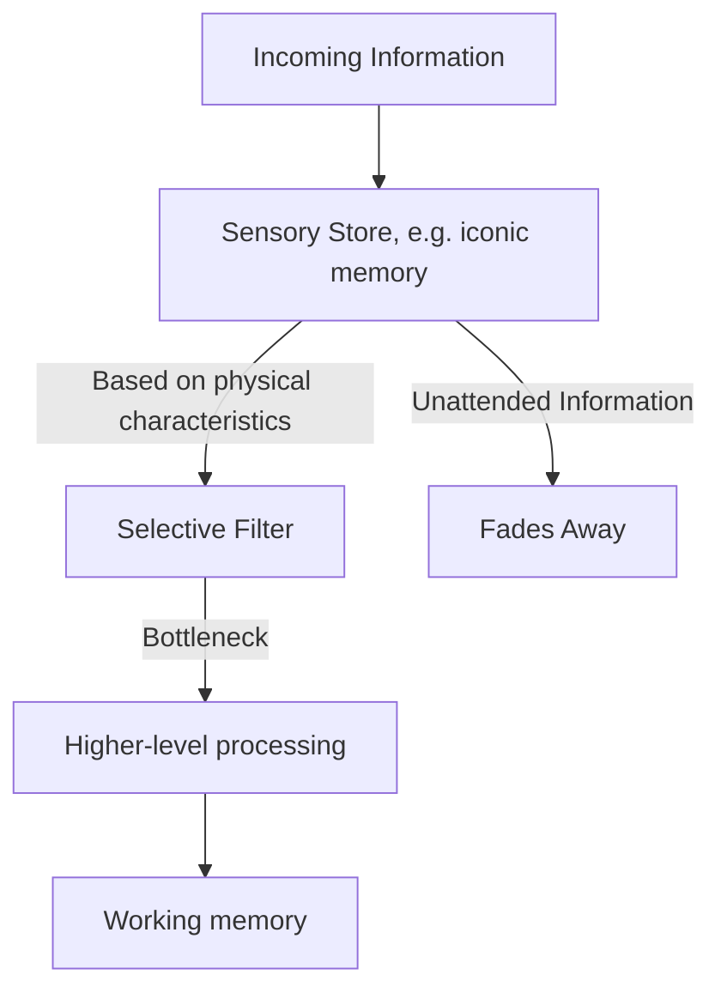

Lots of military funding in the early days of psychological attention research
in the 1950s and 60s. The reason being that you can't shoot at what you can't
attend to.

## in Pyschology

### Cocktail-party problem (1953)

The experiments by Colin Cherry in the 1950s first brought attention to the
concept of selective attention. His experiments involved presenting participants
with two different messages, one in each ear, and instructing them to focus on
just one of the messages. This experiment, known as the **dichotic listening
task**, revealed that while participants could easily recall details about the
message they were instructed to focus on, they remembered almost nothing about
the ignored message. What they did notice are things like a change in sex of the
speaker or a change from voice to tones.

Cherry's experiments were groundbreaking in psychology because they demonstrated
that our perception is not just a passive process - we do not simply absorb all
information presented to us. Instead, our perception is active and selective; we
choose what information to pay attention to and disregard the rest.

This concept of selective attention has since been explored further and has
become a fundamental principle in cognitive psychology. It has been applied in
various fields such as advertising where marketers try to grab consumers'
selective attention or in education where teachers use strategies to keep
students' focused on their lessons.

### Broadbent's filter model (1958)

This model is an early selection theory of attention. It suggests that
information processing is a two-step process. Firstly, all incoming information
is held in a sensory store. However, due to the limited capacity of our
attention, only some of this information can be processed further. This
selection is done purely based on physical characteristics of the incoming
stimuli, like the location or the pitch of a sound.

The selected information then passes through a filter to the short-term memory
store where it can be attended to and comprehended. The unattended information
does not reach conscious awareness and quickly fades away.

#### Criticisms of Broardbent's Filter Model

While Broadbent's model was groundbreaking at its time, it has been criticized
for being too simplistic. Critics argue that it does not account for the times
when unattended information does get processed - like when your name is called
in a crowded room and you instantly turn your head, even if you weren't
consciously listening for it.

### Moray's experiments (1959)

Neville Moray's experiments in 1959 served to address some of the criticisms of
Broadbent's filter model. In his experiments, he had participants perform a
dichotic listening task similar to Cherry's experiment. However, he added the
participants' names into the unattended message.

He found that participants often noticed their name in the unattended message,
suggesting that some unattended information is indeed processed at a higher
level than Broadbent's model would suggest. This finding supports what is known
as the **cocktail party effect** - the ability to focus one's auditory attention
on a particular stimulus while filtering out a range of other stimuli, as when a
partygoer can focus on a single conversation in a noisy room.

### Treisman's attenuation theory (1960)

Anne Treisman proposed an alternative to Broadbent's filter model called the
attenuation theory. According to this theory, all incoming information is
processed, but at different levels of intensity or 'attenuation'.

In this model, instead of completely blocking out unattended information as
suggested by Broadbent, the filter simply reduces its strength or prominence.
This allows for important unattended information (like hearing your name) to be
processed and reach awareness.

### Deutsch & Deutsch's late-selection theory (1963)

Deutsch & Deutsch proposed another alternative to Broadbent's filter model,
known as the late-selection theory. This theory suggests that all incoming
information is processed to the level of meaning before the selection process
takes place.

According to this model, it is not until after we have fully processed and
understood a message that we decide whether to attend to it or not. This would
explain why we can still notice meaningful unattended information, like our name
being called in a crowded room.

### Posner's spotlight model (1980)

Michael Posner proposed the spotlight model of attention in 1980. According to
this model, attention is like a spotlight that can be moved around the
environment to highlight incoming information.

This model suggests that our attentional resources are limited and must be
allocated selectively. The 'spotlight' can be focused narrowly on a single
object or broadly on an entire scene. It can also be moved quickly from one
location to another, allowing us to rapidly shift our focus as needed.
